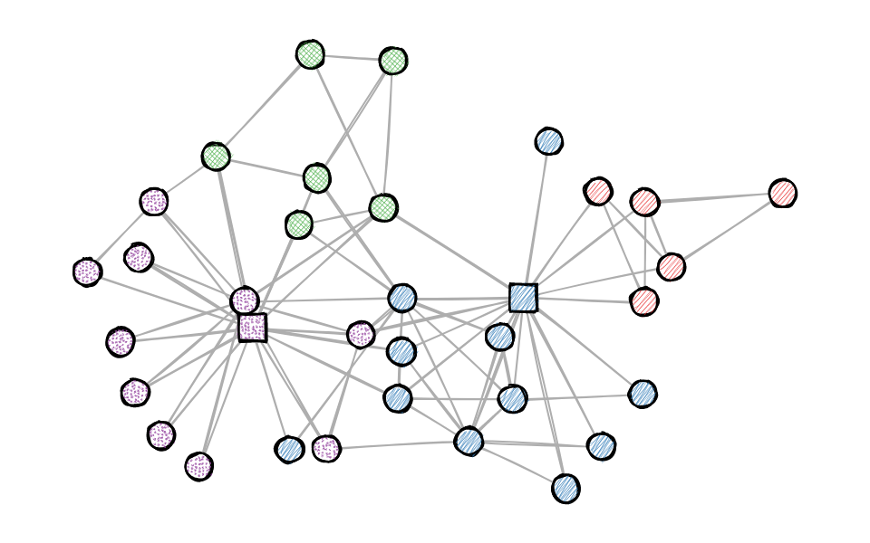

<!-- README.md is generated from README.Rmd. Please edit that file -->

# roughnet

<!-- badges: start -->

[](https://CRAN.R-project.org/package=roughnet)
[](https://www.tidyverse.org/lifecycle/#experimental)
<!-- badges: end -->

Using the java script library [rough.js](https://roughjs.com/) to draw
sketchy, hand-drawn-like networks.  
(*Checkout [ggrough](https://xvrdm.github.io/ggrough/) for turning
general ggplot objects into sketchy drawings*)


## Installation

You can install the developers version of roughnet with:

``` r
# install.packages("remotes")
remotes::install_github("schochastics/roughnet")
```

## Example

``` r
library(roughnet)
library(igraph)

g <- make_graph("Zachary")
V(g)$shape <- "circle"
V(g)$shape[c(1,34)] <- "rectangle"
V(g)$fill <- c("#E41A1C", "#377EB8", "#4DAF4A", "#984EA3")[membership(cluster_louvain(g))]
V(g)$fillstyle <- c("hachure", "zigzag", "cross-hatch", "dots")[membership(cluster_louvain(g))]
V(g)$color <- "black"
V(g)$size <- 30
roughnet(g,width = 960,height=600)
```


